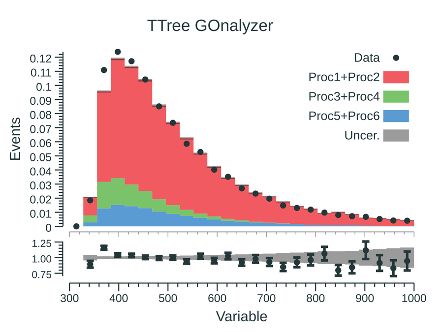

# TTree GOnalyzer

[](https://godoc.org/github.com/rmadar/tree-gonalyzer)

This is a tool written in go to produce publication-quality plots from ROOT TTrees in an flexible and easy way.
This tool is built on top of [go-hep.org](https://go-hep.org).

## In a nutshell

```go
// Define samples
samples := []*ana.Sample{
	ana.CreateSample("data", "data", `Data 2020`, "data.root", "mytree"),
	ana.CreateSample("bkg1", "bkg", `Proc 1`, "proc1.root", "mytree"),
	ana.CreateSample("bkg2", "bkg", `Proc 2`, "proc2.root", "mytree"),
	ana.CreateSample("bkg3", "bkg", `Proc 3`, "proc3.root", "mytree"),
}

// Define variables
variables := []*ana.Variable{
	ana.NewVariable("plot2", "branch2", new(float32), 25, 0, 1000),
}

// Create analyzer object
analyzer := ana.New(samples, variables,
	      ana.WithAutoStyle(true),
	      ana.WithHistoNorm(true),
)

// Run the analyzer to produce all the plots
if err := analyzer.Run(); err != nil {
	panic(err)
}
```

<a href="url"></a> 

{:height="36px"}.


## Example gallery

To come soon.