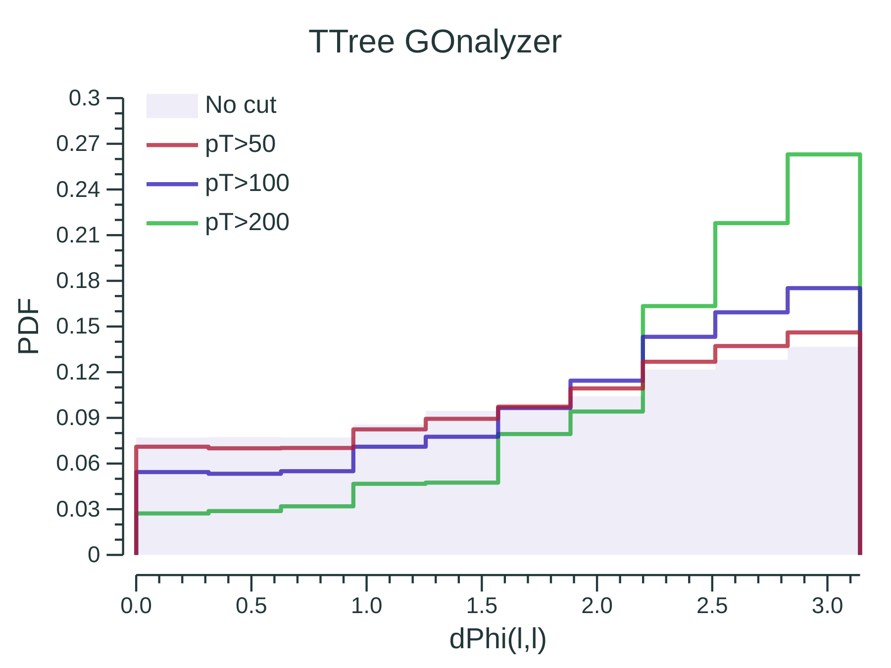

# TTree GOnalyzer

[](https://godoc.org/github.com/rmadar/tree-gonalyzer)

This is a tool written in go to produce publication-quality plots from ROOT TTrees in an flexible and easy way.
This tool is built on top of [go-hep.org](https://go-hep.org). The main supported features are:
 - histograming variables over many samples and selections,
 - displaying one or several signals (overlaid or stacked),
 - sample normalisation using cross-section and/or luminosity and/or number of generated events,
 - computing of new variables of arbitrary complexity,
 - joint trees to the main one, as in `TTreeFriend`,
 - dumping `TTree`'s with `float64` and `[]float64` branches,
 - concurent sample processings.

## In a nutshell

```go
// Define samples
samples := []*ana.Sample{
	ana.CreateSample("data", "data", `Data`, "data.root", "mytree"),
	ana.CreateSample("bkg1", "bkg", `Proc 1`, "proc1.root", "mytree"),
	ana.CreateSample("bkg2", "bkg", `Proc 2`, "proc2.root", "mytree"),
	ana.CreateSample("bkg3", "bkg", `Proc 3`, "proc3.root", "mytree"),
}

// Define variables
variables := []*ana.Variable{
	ana.NewVariable("plot1", ana.TreeVarBool("branchBool"), 2, 0, 2),
	ana.NewVariable("plot2", ana.TreeVarF32("branchF32"), 25, 0, 1000),
	ana.NewVariable("plot3", ana.TreeVarF64("branchF64"), 50, 0, 1000),
}

// Create analyzer object with some options
analyzer := ana.New(samples, variables, ana.WithHistoNorm(true))

// Produce plots and dump trees
analyzer.Run()

```

## Gallery

|[]() |     |     |
|:---:|:---:|:---:|
|  |  | 
| Data/Background [[code](https://godoc.org/github.com/rmadar/tree-gonalyzer/ana#example-package--ASimpleUseCase)]  | Unstacked signals [[code](https://godoc.org/github.com/rmadar/tree-gonalyzer/ana#example-package--WithSignals)] | Stacked signals [[code](https://godoc.org/github.com/rmadar/tree-gonalyzer/ana#example-package--WithStackedSignals)]  |
|  |  | 
| Shape distortion [[code](https://godoc.org/github.com/rmadar/tree-gonalyzer/ana#example-package--ShapeDistortion)]  | Shape comparison [[code](https://godoc.org/github.com/rmadar/tree-gonalyzer/ana#example-package--ShapeComparison)] | Systematic variation [[code](https://godoc.org/github.com/rmadar/tree-gonalyzer/ana#example-package--SystematicVariations)] |

## Performances


For 2M events and 60 variables, a comparison with similar ROOT-based code
(using `t->Draw()`) gives:
 + `ROOT  -> 6.2 ms/kEvts`
 + `GOHEP -> 1.7 ms/kEvts`
 
For 2M event and one variable (avoiding `t->Draw()` repetition)
 + `ROOT  -> 0.39 ms/kEvts`
 + `GOHEP -> 0.10 ms/kEvts`
