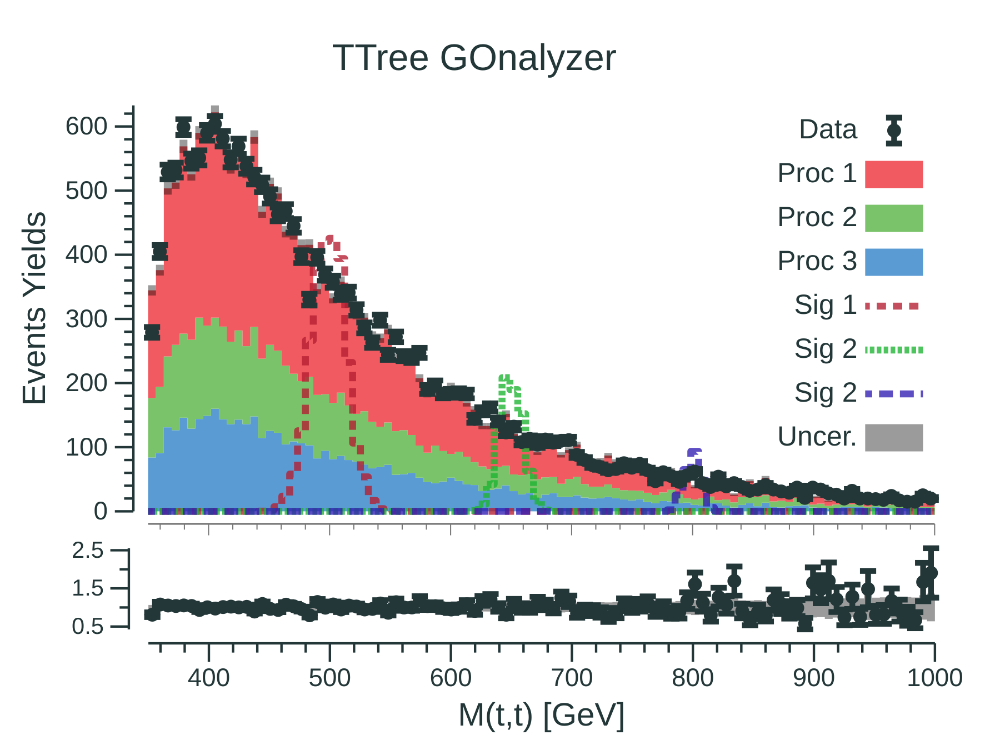
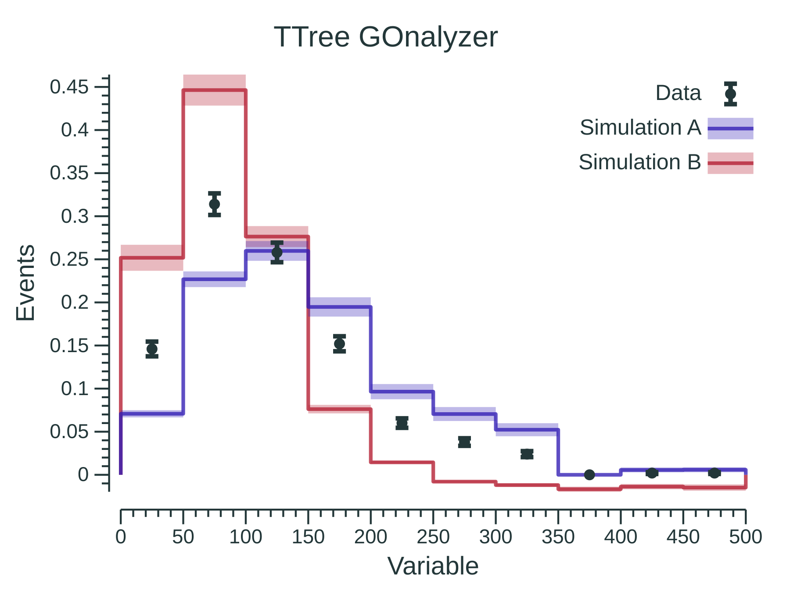

# TTree GOnalyzer

[](https://godoc.org/github.com/rmadar/tree-gonalyzer)

This is a tool written in go to produce publication-quality plots from ROOT TTrees in an flexible and easy way.
This tool is built on top of [go-hep.org](https://go-hep.org).

## In a nutshell

```go
// Define samples
samples := []*ana.Sample{
	ana.CreateSample("data", "data", `Data`, "data.root", "mytree"),
	ana.CreateSample("bkg1", "bkg", `Proc 1`, "proc1.root", "mytree"),
	ana.CreateSample("bkg2", "bkg", `Proc 2`, "proc2.root", "mytree"),
	ana.CreateSample("bkg3", "bkg", `Proc 3`, "proc3.root", "mytree"),
}

// Define variables
variables := []*ana.Variable{
	ana.NewVariable("plot1", ana.NewVarBool("branchBool"), 2, 0, 2),
	ana.NewVariable("plot2", ana.NewVarF32("branchF32"), 25, 0, 1000),
	ana.NewVariable("plot3", ana.NewVarF64("branchF64"), 50, 0, 1000),
}

// Create analyzer object with some options
analyzer := ana.New(samples, variables,
	      ana.WithAutoStyle(true),
	      ana.WithHistoNorm(true),
)

// Produce plots
analyzer.Run()

```

## Gallery

<table>
  <tr>
    <td><p align="center">
	Data/Background <a href="https://godoc.org/github.com/rmadar/tree-gonalyzer/ana#example-package--ASimpleUseCase">[code]</a></p>
    </td>
    <td><p align="center">
	Unstacked signals <a href="https://godoc.org/github.com/rmadar/tree-gonalyzer/ana#example-package--WithSignals">[code]</a></p>
    </td>
    <td><p align="center">
	Stacked signals <a href="https://godoc.org/github.com/rmadar/tree-gonalyzer/ana#example-package--WithStackedSignals">[code]</a></p>
    </td>
</tr>

  <tr>
    <td><p align="center">
	Shape distortion <a href="https://godoc.org/github.com/rmadar/tree-gonalyzer/ana#example-package--ShapeDistortion">[code]</a></p>
    </td>

    <td><p align="center">
	Shape comparison <a href="https://godoc.org/github.com/rmadar/tree-gonalyzer/ana#example-package--ShapeComparison">[code]</a></p>
    </td>

    <td><p align="center">
	Systematic variation <a href="https://godoc.org/github.com/rmadar/tree-gonalyzer/ana#example-package--SystematicVariations">[code]</a></p>
    </td>
  </tr>

  <tr>

  </tr>


 </table>

